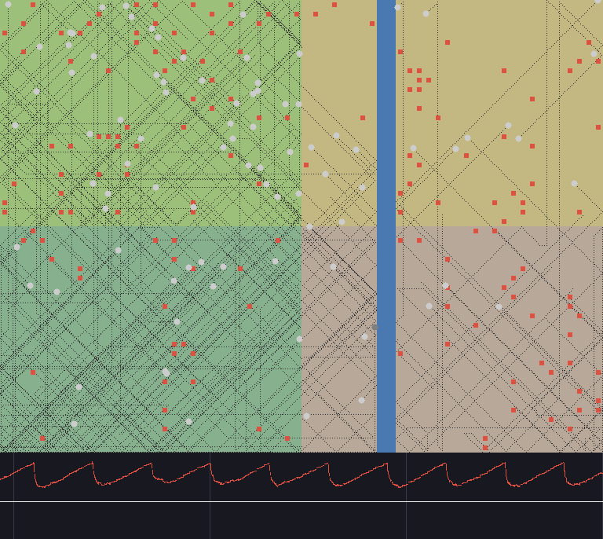
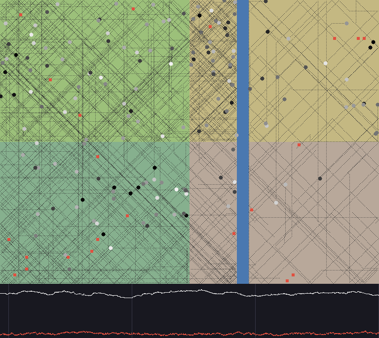

# 1-3: 繁殖（交配・出生・2通貨の点数）

判断は [`docs/history/20260926.md`](../history/20260926.md) の「1-3: 完了条件を満たし、1-3 を閉じる」。

## 1. 概要

- 確かめたかったこと: 成人が視界の中の成人と合意で交配し、手の点数を「死ぬ確率 − `ChildWorth` × 子ができる確率」で比べる形で、出生が起き、崩壊せず、人口が食料の上限まで上がって止まるか。
- 分かったこと: **出生は1シードあたり約 5900〜6000 体、崩壊 0 / 12、人口は両方の地図で約 170 体で横ばい**（交配なしの 1-2e より平坦 +22.8・制約 +88.5）。**交配の手が候補にあれば 99.99% 選ばれ、見送るのは空腹の身体ではなく中くらいの体力の身体**（予想の逆）——死にかけの身体は払っても死ぬ確率がほとんど上がらない。**最初の身体は1体も tick 40000 まで生きない**（死んだ年齢の中央値 1201 tick）。子のために払う体力が大人を死なせ、世代が回る。
- 次にすること: 1-3 を閉じる。老いによる死（O8）は「世代を回すため」の前提が消えたので、1-3 の直後ではなく成長・老い・性別の段階へ回す。次は 1-4（予算の配分）の実装前の数え上げ。

## 2. 条件

| 項目 | 値 |
| --- | --- |
| コミット | 1888d9d（世界のコードは a43c16a から変わっていない。1888d9d は数え上げと崩壊の下限の既定値だけ） |
| マップ | flat (64x48) / constrained (64x48) |
| tick 数 | 40000 |
| シード数 | 12（最初のシード 1） |
| 比較対象（base） | `nobreed`（1-2e の世界。指紋で一致を確かめた） |
| 崩壊の下限 | 20（この段階で決めた仮の値） |
| 代表シード・定常化 tick | flat: シード 1・tick 0 / constrained: シード 8・tick 0 |
| 詳細レポート | このファイル |

**再現方法**:

```
go run ./cmd/experiment -map flat -w 64 -h 48 -variants nobreed,base
go run ./cmd/experiment -map constrained -w 64 -h 48 -variants nobreed,base
go run ./cmd/experiment -map flat -w 64 -h 48
go run ./cmd/experiment -map constrained -w 64 -h 48
go run ./cmd/count -what mate -map flat -w 64 -h 48 -seeds 12 -ticks 40000
go run ./cmd/count -what mate -map constrained -w 64 -h 48 -seeds 12 -ticks 40000
go run ./cmd/count -what breed -map flat -w 64 -h 48 -seeds 12 -ticks 40000
go run ./cmd/count -what breed -map constrained -w 64 -h 48 -seeds 12 -ticks 40000
go run ./cmd/shot -map constrained -w 64 -h 48 -seed 8 -from-tick 20000 -trails -out shots
go run ./cmd/shot -map constrained -w 64 -h 48 -seed 8 -from-tick 20000 -trails -variant nobreed -out shots
```

**UI での再生**:

```
go run ./cmd/client -map flat -w 64 -h 48 -seed 1
go run ./cmd/client -map constrained -w 64 -h 48 -seed 8
```

定常化 tick が 0 になった: 出生と死亡で人口が tick ごとに大きく揺れ、標準偏差が大きいので、tick 0 の 200 体がすでに「平均から標準偏差の範囲内」に入る。立ち上がりの谷（tick 2000 前後で約 128 体）を見たくなければ `-from-tick 5000` から見るとよい。

## 3. 人口推移（base・生存しているシードの平均）

| tick | flat | constrained | 生存シード数 |
| --- | --- | --- | --- |
| 0 | 200.0 ± 0.0 | 200.0 ± 0.0 | 12 / 12・12 / 12 |
| 2000 | 128.0 ± 1.1 | 127.8 ± 1.3 | 12 / 12・12 / 12 |
| 10000 | 175.9 ± 2.3 | 174.5 ± 2.0 | 12 / 12・12 / 12 |
| 20000 | 172.4 ± 1.4 | 171.3 ± 2.0 | 12 / 12・12 / 12 |
| 30000 | 169.8 ± 1.0 | 173.0 ± 1.8 | 12 / 12・12 / 12 |
| 40000 | 171.7 ± 3.2 | 173.3 ± 2.0 | 12 / 12・12 / 12 |

種族は人間だけ。崩壊したシード: 両方の地図で 0 / 12（下限 20）。最後の 4 分の 1（tick 30000 → 40000）の平均の差: flat +1.9、constrained +0.3（どちらも減っていない）。

**個体数の谷**（崩壊しなかったシードの tick 1 以降の最小）: flat 平均 127.0 ± 1.0・最小 122、constrained 平均 126.7 ± 1.3・最小 119。どちらも最初の身体が一斉に空腹になる tick 2000 前後。

## 4. 出来事の回数（base）

| 出来事 | flat | constrained |
| --- | --- | --- |
| 交配 | 5905.92 ± 4.95 | 5986.58 ± 5.01 |
| 出生 | 5905.92 ± 4.95 | 5986.58 ± 5.01 |
| 戦い・コイン・売買 | 0 | 0 |
| 体力消耗（合計） | 705431.3 ± 88.3 | 701448.3 ± 228.6 |
| 死亡 | 5934.25 ± 3.71 | 6013.25 ± 4.16 |

交配は両者が互いを名指しして子が生まれた回数なので、出生と同じ数。

## 5. 行動の選択割合（base）

| 行動 | flat | constrained |
| --- | --- | --- |
| 待つ | 0.01 ± 0.00% | 0.01 ± 0.00% |
| 食べる | 0.33 ± 0.00% | 0.33 ± 0.00% |
| 移動 | 98.31 ± 0.01% | 98.18 ± 0.01% |
| 交配 | 1.35 ± 0.01% | 1.48 ± 0.01% |

「交配」は交配の手を選んだ割合で、応じられなかった申し出を含む。出生 1 体あたりの交配の手: flat 15.83 ± 0.08、constrained 17.17 ± 0.07（下の補助の表）。

## 補助の表: 交配を選んだか（`cmd/count -what mate`、tick 5000 より後）

| 量 | flat | constrained |
| --- | --- | --- |
| 交配の手が候補にあった決定のうち選んだ割合 | 0.9999 ± 0.0000 | 0.9997 ± 0.0000 |
| 選んだ決定の体力の平均 | 50.14 ± 0.07 | 50.05 ± 0.09 |
| 選ばなかった決定の体力の平均 | 62.64 ± 2.66 | 70.00 ± 1.63 |
| 差（選んだ − 選ばなかった） | **−12.50 ± 2.66** | **−19.95 ± 1.68** |
| 払うことによる死ぬ確率の上がり幅: 選んだ（最小・中央値・最大） | 0・0.124・0.5 | 0・0.155・0.5 |
| 同: 選ばなかった | 0.5・0.54・0.801 | 0.501・0.559・0.889 |

**選んだ／選ばなかったは、上がり幅が `ChildWorth`（0.5）の上か下かできれいに分かれる**——比較の結果として選ばれている（トレースの `Score` ＝ `Risk` − 0.5 × `Child`）。体力で分かれてはいない: 死ぬ確率は体力に対して S 字で、**死にかけ（体力が低い）と満腹（高い）の身体は払っても上がり幅が小さく、坂の途中（中くらい）の身体だけが見送る**。

## 補助の表: 成人到達率（base）

| | flat | constrained |
| --- | --- | --- |
| 成人到達率 | 0.7831 ± 0.0011 | 0.7697 ± 0.0012 |

制約の地図のほうが 0.013 低い（地図どうしは対にならないので標準誤差を合わせて ± 0.0016。有意）。

## 補助の表: 寿命（`cmd/count -what breed`、base ＝ 1-3）

| 量 | flat | constrained |
| --- | --- | --- |
| 最初の身体のうち tick 40000 に生きている割合 | 0.0000 | 0.0000 |
| 死んだ年齢（10% 点・中央値・90% 点・最大） | 500・1201・1601・3750 | 500・1201・1601・4351 |

交配なし（1-2e）では最初の身体の 74%・42% が生き残っていた（[数え上げ](20260926-1-3-breed.md)）。10% 点の 500 は、生まれた体力（50 ＝ 500 tick）で一度も食べずに死んだ子。中央値 1201 は成人（1000 tick）の直後。

## 補助の表: 占有地域数（base）

flat は全 tick で 1.00、constrained は全 tick で 4.00（± 0.00）。

## 補助の表: 地域別人口比（constrained・base・後半の平均）

| 地域 | 面積比 | 食料比 | 人口比 |
| --- | --- | --- | --- |
| 0 | 0.258 | 0.500 | 0.429 ± 0.001 |
| 1 | 0.242 | 0.100 | 0.135 ± 0.001 |
| 2 | 0.258 | 0.300 | 0.301 ± 0.001 |
| 3 | 0.242 | 0.100 | 0.135 ± 0.001 |

1-2e（0.468・0.111・0.297・0.124）より、乏しい地域（1・3）の人口比が上がった。子は親の位置に生まれ、豊かな地域の縁で生まれた子が乏しい地域へ流れる。

## 補助の表: 判断のきっかけ（base）

| | flat | constrained |
| --- | --- | --- |
| 決定の割合 | 0.0841 ± 0.0001 | 0.1089 ± 0.0002 |
| first | 0.0103 | 0.0081 |
| underfoot | 0.0868 | 0.0683 |
| sight | 0.1196 | 0.1048 |
| partner | 0.5469 | 0.5546 |
| step | 0.0683 | 0.1247 |
| path | 0.0292 | 0.0230 |
| recheck | 0.0000 | 0.0000 |
| waited | 0.1390 | 0.1165 |

## 6. 記憶・7. スキル別伝承数

この段階には無い。

## 8. 死因別死亡数

餓死が 100%（両方の地図）。

## 9. 対の差（base ＝ `nobreed`）

| 指標 | 地図 | nobreed | 1-3 | 差 |
| --- | --- | --- | --- | --- |
| 人口（最終） | flat | 148.83 ± 0.46 | 171.67 ± 3.21 | **+22.83 ± 3.04** |
| 餓死 | flat | 51.17 ± 0.46 | 5934.25 ± 3.71 | **+5883.08 ± 3.48** |
| 出生 | flat | 0 | 5905.92 ± 4.95 | **+5905.92 ± 4.95** |
| 決定の割合 | flat | 0.0620 ± 0.0007 | 0.0841 ± 0.0001 | **+0.0221 ± 0.0008** |
| 人口（最終） | constrained | 84.83 ± 4.24 | 173.33 ± 1.97 | **+88.50 ± 5.16** |
| 餓死 | constrained | 115.17 ± 4.24 | 6013.25 ± 4.16 | **+5898.08 ± 5.69** |
| 出生 | constrained | 0 | 5986.58 ± 5.01 | **+5986.58 ± 5.01** |
| 決定の割合 | constrained | 0.1424 ± 0.0032 | 0.1089 ± 0.0002 | **−0.0335 ± 0.0033** |

## 絵（観）

同じシード・同じ tick（constrained、シード 8、tick 20000、全員の軌跡つき）。

| 交配なし（`nobreed`） | 1-3（`base`） |
| --- | --- |
|  |  |

交配なしでは地面に食料が余り（158 単位）、身体は白い（満腹）。1-3 では食料が食べ尽くされ（22 単位）、黒い（空腹の）身体が多い。**人口が食料の上限まで上がって止まっている。** 下の帯（赤＝地面の食料）の 300 tick の周期（[1-2q-cycle](20260924-1-2q-cycle.md)）は 1-3 では消える——出生で身体の体力の位相がばらける。上中央の、水の左の乏しい地域の細い帯に身体が多い。

## 予想との照合（PLAN 1-3）

| 予想 | 結果 |
| --- | --- |
| 人口は食料の上限に張り付く: `nobreed` より有意に多く、最後の 4 分の 1 で傾きが負でない | 当たり（+22.8・+88.5、最後の 4 分の 1 は減っていない）。絵でも食料が食べ尽くされている |
| 出生は1シードあたり 100 体以上。餓死も有意に多い | 当たり（約 5900〜6000 体。餓死はほぼ出生と同じだけ増えた） |
| 成人到達率は制約の地図のほうが低い | 当たり（0.770 < 0.783）。ただし差は 0.013 と小さい |
| 交配を選んだ決定の体力は、見送った決定より有意に高い | **外れ（逆）**: 選んだほうが 12.5（平坦）・20.0（制約）低い。死にかけの身体は払っても死ぬ確率がほとんど上がらない |
| 決定の割合は 1-2e より上がるが 0.3 未満 | **半分外れ**: 0.3 未満は当たり（0.084・0.109）。制約の地図では 1-2e より下がった（0.142 → 0.109）——人口が倍になり食料が乏しくなって、身体から見た食料の位置が変わる（sight）きっかけが減った |
| 制約の地図の占有地域数は、ほぼ全 tick で 4 | 当たり（全 tick で 4） |

## 完了条件（PLAN 1-3）

| 条件 | flat | constrained |
| --- | --- | --- |
| 交配・出生が起き（§4）、崩壊しない | 満（約 5900 体、0 / 12） | 満（約 6000 体、0 / 12） |
| 交配が選ばれ、閾値ではなく比較の結果として選ばれていることがトレースで読める（§5） | 満（1.35%。上がり幅が `ChildWorth` の上か下かで分かれる。`Valuation.Child`・`Score`、クライアントの `child 1`） | 満（1.48%） |
| 占有地域数を時系列で記録できる | 満 | 満 |
| `cmd/experiment` に崩壊の下限の仮の既定値が入る | 満（20） | — |
